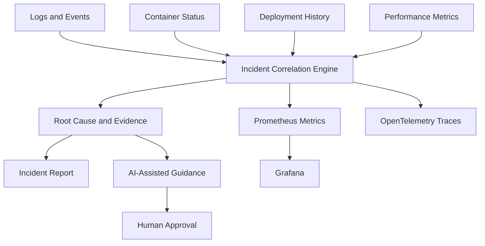

<div align="center">

# 🚨 AI-Assisted Incident Investigation Platform

### Evidence-based incident correlation, observability and human-approved recovery guidance


<br/>

[](https://github.com/hemantsharma2189/ai-incident-investigation-platform/actions/workflows/incident-analysis.yml)

</div>

---

## 📌 Project Overview

This platform correlates application logs, Linux-style operational events, container health, deployment history and performance metrics to support faster incident investigation.

The evidence-based Python engine identifies probable root causes and generates structured incident reports. An optional AI module creates troubleshooting and recovery guidance without automatically executing production changes.

## 🔍 Investigation Capabilities

- Correlates recent deployments with service degradation
- Detects elevated HTTP error rates and latency
- Identifies CPU and memory saturation
- Detects repeated container restarts
- Extracts critical application log evidence
- Assigns severity and confidence levels
- Generates structured Markdown incident reports
- Exposes Prometheus-compatible metrics
- Emits OpenTelemetry investigation traces
- Requires human approval for recovery actions

## 🏗️ Architecture



## 📁 Project Structure

```text
ai-incident-investigation-platform/
├── .github/
│   └── workflows/
│       └── incident-analysis.yml
├── examples/
│   └── deployment-failure.json
├── monitoring/
│   └── prometheus.yml
├── tests/
│   └── test_incident_analyzer.py
├── ai_incident_assistant.py
├── incident_analyzer.py
├── metrics_exporter.py
├── telemetry.py
├── Dockerfile
├── docker-compose.yml
├── requirements.txt
├── LICENSE
└── README.md
```

## 🧪 Included Incident Scenario

The included scenario represents a failed checkout-service deployment with:

- Version `v2.4.0` deployed shortly before the incident
- HTTP error rate of `18.5%`
- Average latency of `1450 ms`
- CPU utilization of `91%`
- Six container restarts
- Database connection and HTTP 500 errors

The engine correlates this evidence and identifies the recent deployment as a probable cause.

## ▶️ Run Locally

Clone the repository:

```bash
git clone https://github.com/hemantsharma2189/ai-incident-investigation-platform.git
cd ai-incident-investigation-platform
```

Install dependencies:

```bash
pip install -r requirements.txt
```

Run the investigation:

```bash
python incident_analyzer.py examples/deployment-failure.json
```

The report is saved as:

```text
incident-report.md
```

## 🐳 Run with Docker

Build the image:

```bash
docker build -t incident-investigator .
```

Run the analyzer:

```bash
docker run --rm incident-investigator
```

The container runs as a non-root user.

## 📊 Start the Observability Stack

Start the metrics exporter, Prometheus and Grafana:

```bash
docker compose up --build
```

Services:

| Service | URL |
|---|---|
| Metrics exporter | `http://localhost:8000/metrics` |
| Health endpoint | `http://localhost:8000/health` |
| Prometheus | `http://localhost:9090` |
| Grafana | `http://localhost:3000` |

Default local Grafana credentials:

```text
Username: admin
Password: admin
```

These credentials are intended only for local demonstration and must be changed for shared environments.

## 📈 Available Prometheus Metrics

```text
incident_http_error_rate_percent
incident_average_latency_ms
incident_cpu_percent
incident_memory_percent
incident_container_restarts_total
```
## 🚨 Prometheus Alerts

The platform includes alert rules for:

- HTTP error rate above 5%
- Application latency above 1000 ms
- CPU utilization above 85%
- Memory utilization above 85%
- More than three container restarts
- 
## 🔭 OpenTelemetry Tracing

Without an OTLP endpoint, traces are printed to the console.

To export traces to an OpenTelemetry-compatible collector:

```bash
export OTEL_EXPORTER_OTLP_ENDPOINT="http://localhost:4318/v1/traces"
python incident_analyzer.py examples/deployment-failure.json
```

Investigation traces include:

- Incident ID
- Affected service
- Finding count
- Severity
- Finding title
- Confidence level

## 🤖 AI-Assisted Investigation

Configure an OpenAI-compatible API safely:

```bash
export AI_API_KEY="your-api-key"
export AI_MODEL="your-model-name"
export AI_API_URL="your-compatible-api-endpoint"
```

First generate the evidence-based report:

```bash
python incident_analyzer.py examples/deployment-failure.json
```

Then generate AI-assisted guidance:

```bash
python ai_incident_assistant.py incident-report.md
```

The output includes:

- Incident summary
- Probable root cause
- Supporting evidence
- Containment steps
- Recovery recommendations
- Prevention actions
- Confidence level

> Never commit an API key. AI recommendations require human review.

## ✅ Automated Testing

Run the tests:

```bash
python -m unittest discover -s tests -v
```

## 🔄 CI/CD Pipeline

GitHub Actions automatically:

- Installs Python dependencies
- Runs automated tests
- Generates an incident report
- Uploads the report as an artifact
- Builds the Docker image
- Tests the container
- Validates Docker Compose
- Verifies health and Prometheus endpoints

## 🛑 Recovery Safety

The project does not automatically restart services, roll back deployments or modify infrastructure.

All recovery actions require human approval followed by health validation.

## 🚀 Future Enhancements

- Grafana dashboard provisioning

- Kubernetes deployment manifests
- Slack or email incident notifications
- OpenTelemetry Collector integration
- Approved rollback workflow

## 👨‍💻 Author

**Hemant Sharma**

Cloud & DevOps Engineer focused on AWS, Terraform, Kubernetes, CI/CD, observability and cloud security.

[LinkedIn](https://www.linkedin.com/in/hemantsharma20/) •
[GitHub](https://github.com/hemantsharma2189) •
[Portfolio](https://hemantsharma2189.github.io/Hemant-Sharma-Portfolio/)

---

<div align="center">

⭐ Star this repository if you find it useful.

</div>
